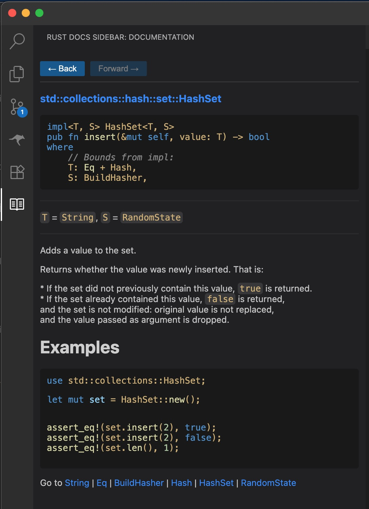

# rust-docs-sidebar README

Displays Rust docs for the selected symbol in a sidebar. Very fast (queries local docs using grep) but functionality is limited.

## Features

## Release Notes

### 0.0.1

Initial release, buggy but usable.
